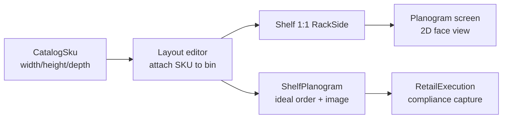

# Frontend Integration Guide: Planogram Visualization

**Status:** Backend implemented. Catalog Planogram authoring is retired. The portal **planogram screen** is a read-only visualization of StoreLayout (shelf → rack side → rows → bins → SKUs).

**Related docs:**
- [FRONTEND_SHELF_MIGRATION.md](./FRONTEND_SHELF_MIGRATION.md) — CatalogPlanogram removal + Shelf CRUD
- [FRONTEND_RACK_BLUEPRINT.md](./FRONTEND_RACK_BLUEPRINT.md) — rack structure / 3D blueprint
- [LAYOUT_SCALE_SPEC.md](./LAYOUT_SCALE_SPEC.md) — meters, coordinates, hierarchy
- [AI_Planogram_Builder_Shelf_and_Fixture_Types.md](./AI_Planogram_Builder_Shelf_and_Fixture_Types.md) — fixture vocabulary for designers

**Units:** all dimensions are **meters**. Display cm/mm in UI; send/store meters.

**Auth:** `layout:view` (GET), `layout:manage` (POST/PUT). After deploy, run `POST /api/v1/permissions/sync` so new action paths are registered.

**Response envelope:** all endpoints return `ApiEnvelope<T>` (`success`, `data`, `message`, `errors`).

---

## 1. Conceptual shift

| Before (retired) | Now |
|------------------|-----|
| Author planogram rows/slots in Catalog | Place SKUs into rack bins in StoreLayout |
| Publish planogram → ideal order JSON | Ideal order auto-projected from bin layout |
| Planogram screen = CRUD editor | Planogram screen = **visualize** one shelf face |
| `catalog_planograms` entity | `Shelf` + `StoreRackSide` + `ShelfPlanogram` projection |



**Authoring** happens in the store layout / rack editor. **Planogram screen** only renders the result for a selected shelf.

---

## 2. User journeys (designer wireframes)

### Browse / visualize

1. Pick store
2. Open shelf list (`GET /api/v1/layout/shelves?storeId=`)
3. Select shelf → planogram view (`GET .../shelves/{shelfId}/blueprint`)
4. Render 2D front face: rows (`yStart`/`yEnd`) × bins (`xStart`/`xEnd`) × products/facings

### Edit layout

From planogram view, deep-link to layout editor:

- Use `rackId` + `rackSideId` from `ShelfDetailDto` / blueprint response
- Load `GET /api/v1/layout/racks/{rackId}/structure`
- Place/move SKUs via `POST /api/v1/layout/bin-inventory/attach` (and detach)

### Compliance setup (optional)

1. Presign upload: `POST .../shelves/{shelfId}/planogram/presign-upload`
2. PUT file to `uploadUrl`
3. Confirm: `PUT .../shelves/{shelfId}/planogram` with `idealImageStorageKey`
4. Ideal **order** remains server-derived — do not send order JSON from the client

---

## 3. Screen anatomy (planogram view)

| Region | Content |
|--------|---------|
| **Header** | Shelf name, category, rack code, side code, “Edit in layout” CTA |
| **Canvas** | 2D shelf-face: rows stacked by `yStart`/`yEnd`; bins left→right by `xStart`/`xEnd`; facings from `products[]` or bin SKU × quantity |
| **Legend** | Empty bin, missing SKU dimensions, OOS / zero quantity |
| **Footer** | Total facings, distinct SKU count, link to row inventory |

This is **not** the full store floor plan (that stays in the layout editor / 3D rack view). One shelf = one rack face.

---

## 4. API quick reference

| Task | Method | Route | Permission |
|------|--------|-------|------------|
| Shelf picker | GET | `/api/v1/layout/shelves?storeId=&search=&page=&pageSize=` | `layout:view` |
| Shelf detail | GET | `/api/v1/layout/shelves/{shelfId}` | `layout:view` |
| Planogram render data | GET | `/api/v1/layout/shelves/{shelfId}/blueprint` | `layout:view` |
| Ideal order / image | GET | `/api/v1/layout/shelves/{shelfId}/planogram` | `layout:view` |
| Presign ideal photo | POST | `/api/v1/layout/shelves/{shelfId}/planogram/presign-upload` | `layout:manage` |
| Save ideal photo / SOS brand | PUT | `/api/v1/layout/shelves/{shelfId}/planogram` | `layout:manage` |
| Link shelf ↔ rack side | PUT | `/api/v1/layout/rack-sides/{rackSideId}/shelf` | `layout:manage` |
| Place SKU | POST | `/api/v1/layout/bin-inventory/attach` | `layout:manage` |
| Full rack editor | GET | `/api/v1/layout/racks/{rackId}/structure` | `layout:view` |

### Create rack auto-links shelves

`POST /api/v1/layout/racks` now creates one `Shelf` per rack side and sets `StoreRackSide.shelfId`. Names default to `{rackCode}-{sideCode}` (e.g. `R-01-S1`).

### Link existing / create shelf for a side

```http
PUT /api/v1/layout/rack-sides/{rackSideId}/shelf
```

```json
// Link existing
{ "shelfId": "guid", "createShelf": false }

// Or create new
{ "createShelf": true, "name": "Dairy Face", "categoryId": null, "shelfType": 1 }
```

Rejects if the side or shelf is already linked (1:1).

---

## 5. TypeScript types

```typescript
type ShelfType = 1 | 2; // 1=BrandDedicated, 2=Shared

interface ShelfSummaryDto {
  id: string;
  name: string;
  sortOrder: number;
  categoryId: string | null;
  shelfType: ShelfType;
}

interface ShelfListItemDto {
  id: string;
  storeId: string;
  name: string;
  sortOrder: number;
  categoryId: string | null;
  shelfType: ShelfType;
  isActive: boolean;
  rackSideId: string | null;
  rackId: string | null;
  rackCode: string | null;
  sideCode: string | null;
  hasLayout: boolean;
  hasPlanogram: boolean;
}

interface ShelfDetailDto extends ShelfListItemDto {}

interface ShelfPlanogramDto {
  shelfId: string;
  idealImageUrl: string | null;      // presigned when storage enabled
  idealImageOrderJson: string;       // {"rows":{"0":["Sku",...]}}
  sosTargetBrand: string | null;
  isConfigured: boolean;             // ideal image + order present
}

interface ShelfBlueprintDto {
  shelf: ShelfDetailDto;
  side: RackBlueprintSideDto;        // includes shelfId + shelf
  rackOuter: { width: number | null; depth: number | null; height: number | null };
  rackInner: { width: number | null; depth: number | null; height: number | null };
}

// Extended on structure/blueprint side DTOs:
interface RackBlueprintSideDto {
  sideId: string;
  sideCode: string | null;
  dimensions: { usableWidth: number | null; usableDepth: number | null; usableHeight: number | null } | null;
  shelfId: string | null;
  shelf: ShelfSummaryDto | null;
  rows: RackBlueprintRowDto[];
}
```

Reuse row/bin/product shapes from [FRONTEND_RACK_BLUEPRINT.md](./FRONTEND_RACK_BLUEPRINT.md).

---

## 6. Catalog SKU dimensions (required for new SKUs)

| Operation | Rule |
|-----------|------|
| `POST /api/v1/catalog/skus` | `width`, `height`, `depth` **required**, each `> 0` (meters) |
| `PUT /api/v1/catalog/skus/{id}` | If any dimension is set, all three must be `> 0`. Clearing to null is allowed only if the SKU is **not** on an active bin |
| `POST .../bin-inventory/attach` | Still rejects when bin or SKU dimensions are missing |

**UI:** make width/height/depth required on the create-SKU form. On edit, warn before clearing dimensions if the SKU is placed on a rack.

---

## 7. Ideal image upload flow

```text
1. POST /api/v1/layout/shelves/{shelfId}/planogram/presign-upload
   Body: { "fileName": "ideal.png", "contentType": "image/png" }
   → { storageKey, uploadUrl, method, expiresAtUtc, headers }

2. HTTP PUT uploadUrl (raw file bytes, Content-Type from step 1)

3. PUT /api/v1/layout/shelves/{shelfId}/planogram
   Body: { "idealImageStorageKey": "<storageKey>", "sosTargetBrand": "Almarai" }
   → ShelfPlanogramDto (idealImageUrl may be presigned download URL)
```

Do **not** send `idealImageOrderJson` — the server refreshes it from the linked rack layout.

---

## 8. Edge cases

| Case | UI behavior |
|------|-------------|
| Shelf with `hasLayout: false` | Empty state: “No layout assigned” + CTA to link shelf or open layout editor |
| `GET .../blueprint` on unlinked shelf | `404` / business error: “No rack layout is linked to this shelf.” |
| SKU missing dimensions | Placeholder tile + link to edit SKU; attach will fail until dims set |
| Double-sided rack | Two shelves (S1/S2); planogram view is **per shelf**, not both faces at once |
| Empty bins | Show empty slot in canvas |

---

## 9. Removed UI (do not rebuild)

Delete all Catalog Planogram authoring screens and clients under `api/v1/catalog/planograms/*`. See checklist in [FRONTEND_SHELF_MIGRATION.md](./FRONTEND_SHELF_MIGRATION.md).

---

## 10. Designer notes

- Planogram screen = **2D shelf-face** merchandising view (shopper-facing).
- Store floor / rack placement / 3D shell stays in the **layout editor** (blueprint contract).
- Fixture types and naming: [AI_Planogram_Builder_Shelf_and_Fixture_Types.md](./AI_Planogram_Builder_Shelf_and_Fixture_Types.md).
- Copy: prefer “Shelf” / “Planogram view” over “Catalog planogram”.

---

## 11. Frontend checklist

- [ ] Delete Catalog Planogram CRUD UI/clients
- [ ] Shelf list from `GET /api/v1/layout/shelves?storeId=`
- [ ] Planogram canvas from `GET .../shelves/{shelfId}/blueprint`
- [ ] Deep-link to rack editor using `rackId` / `rackSideId`
- [ ] Catalog SKU create: require width/height/depth (meters)
- [ ] Ideal image: presign → upload → `PUT .../planogram`
- [ ] Empty states for unlinked shelves and missing dimensions
- [ ] After deploy: ensure role has `layout:view` / `layout:manage`; run permissions sync
