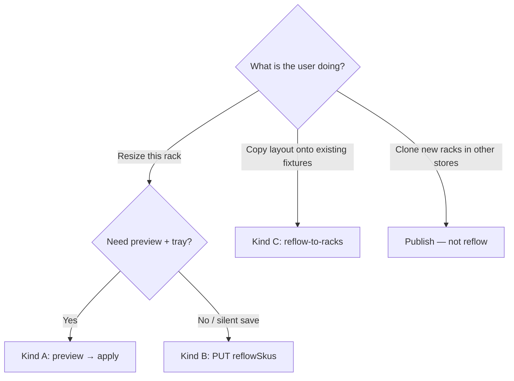
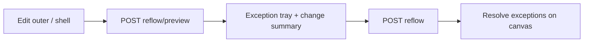
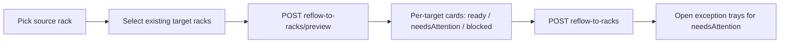

# Frontend Integration Guide: Reflow

How to explain, preview, and apply every reflow path in StoreLayout.

**Auth:** `layout:manage` on all endpoints below.

**Units:** meters — see [LAYOUT_SCALE_SPEC.md](./LAYOUT_SCALE_SPEC.md).

**Envelope:** responses use `ApiEnvelope<T>` (`success`, `data`, `errors`, `message`). Tables below describe `data`.

---

## 1. What reflow is

**Reflow** adapts an existing rack’s row/bin geometry and SKU facing quantities after fixture size or layout mapping changes.

It always:

1. Recomputes the rack **inner cavity** from outer + shell
2. **Rescales** row heights (share of usable stack height) and bin widths (share of row span)
3. **Redraws** row/bin anchors (`YStart`/`YEnd`, `XStart`/`XEnd`)
4. **Recomputes capacity** and fills quantity to the new max (`FillToCapacity`)
5. Returns **diff lists**: `quantityChanges`, `geometryChanges`, `exceptions`

It does **not** silently detach SKUs. Unfit products stay on the bin with qty/max `0` and appear in `exceptions` for the UI exception tray.

### What reflow is not

| Feature | Endpoint pattern | Difference |
| -------- | ---------------- | ---------- |
| **Publish** (clone) | `.../publish`, `.../publish/preview` | Creates **new** racks in other stores at **same** dimensions. Not a reflow. |
| **Blueprint edit** | ordinary bin/row PUT/PATCH | Local edits; no proportional cascade unless you opt into reflow |

Publish + reflow overview (clone wizard + links): [FRONTEND_RACK_PUBLISH_AND_REFLOW.md](./FRONTEND_RACK_PUBLISH_AND_REFLOW.md).

---

## 2. Kinds of reflow (decision matrix)

| Kind | When to use | Preview | Commit | Keeps floor placement? | Changes outer/shell? |
| ---- | ----------- | ------- | ------ | ---------------------- | -------------------- |
| **A. Single-rack resize** | User edits this rack’s width/depth/height or shell | `POST .../reflow/preview` | `POST .../reflow` | Yes | Yes (proposed dims) |
| **B. Update hook** | Same resize, but saving via full rack PUT without a dedicated preview step | _(none — no change DTOs)_ | `PUT .../racks/{id}` + `reflowSkus: true` | Yes | Yes (in PUT body) |
| **C. Multi-rack (map source → targets)** | Push a golden/source layout onto **existing** racks (same or other stores) that already have their own sizes | `POST .../reflow-to-racks/preview` | `POST .../reflow-to-racks` | Yes (targets) | No — targets keep their outer/shell |

**Prefer A over B** whenever the UI needs an exception tray or quantity/geometry diff before save. B is a compatibility shortcut and returns no reflow diff payload.



---

## 3. Shared contracts

### 3.1 Quantity / geometry / exception DTOs

Used by Kind A (`data`) and Kind C (`data.targets[]`).

```ts
type RackReflowQuantityChange = {
  binId: string;
  skuId: string | null;
  skuName: string | null;
  fromQuantity: number | null;
  toQuantity: number | null;
  fromMaxQuantity: number | null;
  toMaxQuantity: number | null;
};

type RackReflowGeometryChange = {
  entityId: string; // row or bin id
  field: string;    // e.g. "height" | "width"
  from: number | null;
  to: number | null;
};

type RackReflowException = {
  code: string;
  binId: string | null;
  rowId: string | null;
  skuId: string | null;
  message: string;
};

type RackReflowResult = {
  quantityChanges: RackReflowQuantityChange[];
  geometryChanges: RackReflowGeometryChange[];
  exceptions: RackReflowException[];
};
```

### 3.2 Exception codes

| Code | Meaning | SKU stays on bin? | Suggested UI actions |
| ---- | ------- | ----------------- | -------------------- |
| `SkuDoesNotFit` | After resize/map, capacity is 0 | Yes (qty/max → 0) | Move, replace SKU, widen bin, or undo |
| `MissingDimensions` | SKU or bin dims missing — capacity unknown | Yes | Set dimensions, move, or undo |
| `RowSpanOverflow` | Explicit row `span` exceeds inner width | n/a | Clear/override span, undo resize |
| `BinWidthsOverflow` | Rescaled bin widths exceed row span | n/a | Fix row/bins, undo |
| `RowHeightsOverflow` | Rescaled row heights exceed usable stack | n/a | Fix rows/shell, undo |

**Rule:** never hide unfit SKUs. Treat `exceptions` as the source of truth for the tray; use `quantityChanges` / `geometryChanges` for “what will change” summaries.

### 3.3 Capacity policy (backend behavior)

Reflow paths use **`FillToCapacity`**: after geometry updates, `quantity` is set to the new `maxQuantity` (not merely clamped).

Packing is fixed-axis (no rotation): facings across width × height × depth stack. See server `BinCapacityCalculator`.

| Policy | Used by | Effect on quantity |
| ------ | ------- | ------------------ |
| `FillToCapacity` | All reflow endpoints | Always set to new max |
| `ClampOnly` | Internal (publish validation, SKU dim updates) | Never increase; clamp down if over max |

FE does not select the policy — endpoint implies it.

### 3.4 Request dimension shapes

```ts
type RackDimensions = {
  width?: number | null;
  depth?: number | null;
  height?: number | null;
};

type RackShell = {
  wallThickness?: number | null;
  walls?: { back?: boolean; left?: boolean; right?: boolean; frontGlass?: boolean } | null;
  header?: { enabled?: boolean; width?: number; depth?: number; height?: number; /* … */ } | null;
  footer?: { /* same shape as header */ } | null;
  frame?: { cornerPosts?: number; topRail?: boolean; innerFloor?: boolean } | null;
  materials?: { accentColor?: string; wallColor?: string; postColor?: string } | null;
  headerPosmItemId?: string | null;
  footerPosmItemId?: string | null;
  leftWallPosmItemId?: string | null;
  rightWallPosmItemId?: string | null;
};
```

---

## 4. Kind A — Single-rack resize reflow

**Goal:** User changes this rack’s outer and/or shell; layout and facings adapt in place.

### Preview (dry-run)

```
POST /api/v1/layout/racks/{rackId}/reflow/preview
```

```json
{
  "outer": { "width": 1.8, "depth": 0.5, "height": 1.0 },
  "shell": { "wallThickness": 0.08 }
}
```

Both `outer` and `shell` are optional — send only fields that are changing. Preview **does not persist**.

**Response `data`:** `RackReflowResult` (see §3.1).

### Apply (persist)

```
POST /api/v1/layout/racks/{rackId}/reflow
```

Same body. Persists dimension + reflowed layout and refreshes ideal-order projections.

**Commit is allowed when `exceptions` is non-empty.** Show the tray after success for follow-up fixes.

### UI flow



### Implementation notes

- Optimistic local resize for UX is fine; **authoritative** diffs come from preview.
- After apply, refetch rack blueprint / layout before editing further.
- Ideal-order shelves refresh server-side — no separate FE call.

---

## 5. Kind B — `PUT` rack with `reflowSkus`

**Goal:** Same geometric cascade as Kind A, triggered as part of a normal rack update.

```
PUT /api/v1/layout/racks/{rackId}
```

```json
{
  "reflowSkus": true,
  "outer": { "width": 1.8, "depth": 0.5, "height": 1.0 },
  "shell": { "wallThickness": 0.08 },
  "sides": [ ]
}
```

| Field | Default | Behavior |
| ----- | ------- | -------- |
| `reflowSkus` | `false` | When `true`, after sides/dims are applied, runs `RackReflow.Apply` then saves |

**Caveats for FE:**

- Response is a normal update success — **no** `quantityChanges` / `geometryChanges` / `exceptions` payload.
- Do **not** use B if you need an exception tray before commit.
- If you already called Kind A apply, do not also send `reflowSkus: true` on a redundant PUT (double apply / confusing diffs).

---

## 6. Kind C — Multi-rack reflow (source → existing targets)

**Goal:** Take a well-set **source** rack and map its SKU/bin topology onto **existing** target racks. Each target keeps its own outer/shell and floor placement; facings reflow to that fixture.

Use when publishing (clone) is wrong because the targets **already exist** and have different sizes.

### Preview

```
POST /api/v1/layout/racks/{sourceRackId}/reflow-to-racks/preview
```

```json
{
  "targetRackIds": ["guid", "guid"]
}
```

### Apply

```
POST /api/v1/layout/racks/{sourceRackId}/reflow-to-racks
```

Same body.

### Response `data`

```ts
type MultiRackReflowResponse = {
  targets: MultiRackReflowTargetResult[];
};

type MultiRackReflowTargetResult = {
  rackId: string;
  storeId: string;
  status: "ready" | "needsAttention" | "blocked" | "applied";
  outer: RackDimensions | null; // target dims used for the reflow
  quantityChanges: RackReflowQuantityChange[];
  geometryChanges: RackReflowGeometryChange[];
  exceptions: RackReflowException[];
  warnings: string[];
  errors: string[];
};
```

### Per-target status

| Status | Preview | Apply | Meaning |
| ------ | ------- | ----- | ------- |
| `ready` | ✓ | — | Eligible; no reflow exceptions |
| `needsAttention` | ✓ | ✓ | Eligible but `exceptions.length > 0` — still commitable |
| `blocked` | ✓ | ✓ | Not applied / skipped — see `errors` |
| `applied` | — | ✓ | Persisted successfully (no exceptions) |

**Apply rules:**

- `blocked` targets are **skipped** (not fatal for the whole request).
- `ready` / `needsAttention` are persisted.
- Commit with exceptions is intentional (`needsAttention`).

### Extra behavior vs Kind A

After the shared resize cascade, multi-rack also **syncs each bin’s height to its row height**, then recomputes capacity again. Expect `geometryChanges` with `field: "height"` on bins more often than Kind A.

### Structural / eligibility blockers (target `errors`)

Examples (message text may vary slightly):

| Pattern | Cause |
| ------- | ----- |
| Source and target must be different | Same rack id in `targetRackIds` |
| Target missing outer dimensions | Target width/height/depth incomplete |
| Source has N side(s) but target only has M | Source sides > target sides |
| No active sides | Source or target has nothing to map |
| `SKU {id} is missing or inactive` | Catalog SKU unavailable for org |
| `PosmNotAssignedToStore: …` | POSM on layout not assigned to target store |

### Soft warnings (non-blocking)

| Pattern | Cause |
| ------- | ----- |
| Target side had no matching source side; layout cleared | Extra target sides cleared when unpaired |
| POSM / mapping notices | Soft info during map |

### Side pairing

Sides are matched for layout copy; unpaired **target** sides are cleared (warning). Targets must have **at least as many** active sides as the source.

### What is kept on the target

- Outer / shell dimensions
- Floor placement (`position`, `placement`, `snapMode`, `quadrant`)
- Rack identity / store membership

### What is overwritten from the source

- Side row/bin topology, SKU assignments, quantities (then reflowed)
- POSM refs (subject to store assignment validation)

### UI flow



---

## 7. Exception tray & change summary (shared UX)

Recommended components:

1. **Change summary**
   - Count of qty increases / decreases
   - Count of geometry field changes
2. **Exception tray**
   - Group by `code`
   - Deep-link to `binId` / `rowId` / `skuId` on the canvas
3. **Status chips (Kind C only)**
   - Map target `status` to color; blocked shows `errors`, needsAttention shows `exceptions`

Do not treat HTTP 200 + non-empty `exceptions` as failure. That is a successful apply that still needs planner attention.

---

## 8. Suggested TypeScript client surface

```ts
// Kind A
previewRackReflow(rackId: string, body: { outer?: RackDimensions; shell?: RackShell }): Promise<RackReflowResult>;
applyRackReflow(rackId: string, body: { outer?: RackDimensions; shell?: RackShell }): Promise<RackReflowResult>;

// Kind B
updateStoreRack(rackId: string, body: UpdateStoreRackBody & { reflowSkus?: boolean }): Promise<void>;

// Kind C
previewMultiRackReflow(sourceRackId: string, body: { targetRackIds: string[] }): Promise<MultiRackReflowResponse>;
applyMultiRackReflow(sourceRackId: string, body: { targetRackIds: string[] }): Promise<MultiRackReflowResponse>;
```

Route prefix: `/api/v1/layout/racks`.

---

## 9. End-to-end checklist

### Resize (Kind A)

- [ ] Debounced or explicit “Preview impact” calls `POST .../reflow/preview`
- [ ] Render quantity + geometry diffs; show tray if `exceptions.length > 0`
- [ ] User can still commit via `POST .../reflow`
- [ ] After apply, refetch layout; keep tray open until exceptions cleared
- [ ] Units in meters; convert only in display layer

### Silent resize (Kind B)

- [ ] Only used when no preview UI is required
- [ ] `reflowSkus: true` set together with dimension fields
- [ ] Documented internally that exceptions are not returned

### Multi-rack (Kind C)

- [ ] Source ≠ any target (UI prevent + handle blocked)
- [ ] Preview shows per-target status + outer dims + diffs
- [ ] Blocked targets listed with `errors`; not sent as “failed whole op”
- [ ] Apply allowed with `needsAttention`
- [ ] After apply, refresh each applied rack; open trays for exceptions

### Shared

- [ ] Never auto-remove SKUs on `SkuDoesNotFit`
- [ ] Permission: user has `layout:manage`
- [ ] Do not confuse with publish (`.../publish`)

---

## 10. Quick API reference

| Kind | Method | Path |
| ---- | ------ | ---- |
| A preview | `POST` | `/api/v1/layout/racks/{rackId}/reflow/preview` |
| A apply | `POST` | `/api/v1/layout/racks/{rackId}/reflow` |
| B hook | `PUT` | `/api/v1/layout/racks/{rackId}` (`reflowSkus: true`) |
| C preview | `POST` | `/api/v1/layout/racks/{sourceRackId}/reflow-to-racks/preview` |
| C apply | `POST` | `/api/v1/layout/racks/{sourceRackId}/reflow-to-racks` |

---

## 11. Related docs

| Doc | Use for |
| --- | ------- |
| [FRONTEND_RACK_PUBLISH_AND_REFLOW.md](./FRONTEND_RACK_PUBLISH_AND_REFLOW.md) | Publish (clone) wizard + short reflow pointers |
| [FRONTEND_RACK_BLUEPRINT.md](./FRONTEND_RACK_BLUEPRINT.md) | Rack / side / row / bin field model |
| [FRONTEND_SHELF_TALKER_AND_RACK_ZONES.md](./FRONTEND_SHELF_TALKER_AND_RACK_ZONES.md) | Zones and POSM |
| [LAYOUT_SCALE_SPEC.md](./LAYOUT_SCALE_SPEC.md) | Meters, coordinates, packing |
| [FRONTEND_CHANGES_VS_MAIN.md](./FRONTEND_CHANGES_VS_MAIN.md) | Changelog / migration checklist vs main |
