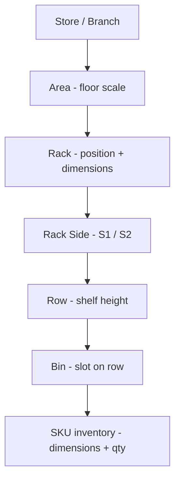

# Planogram Layout & Scale Specification

> **Purpose:** Define how we scale the full store floor, place racks in real coordinates, size racks/bins/products, and support multiple SKUs per bin — with one consistent data model for the 3D viewer, Traditional view, API sync, and export/import.

---

## 1. Design principles

| Principle | Rule |
|-----------|------|
| **Single unit system** | All real-world dimensions in **meters (m)**. UI may show cm/mm but store values in meters. |
| **Single origin** | Floor center is `(0, 0, 0)`. +X = East, +Z = South (Three.js convention). +Y = up. |
| **Hierarchy** | `Store → Area (floor) → Rack → Side → Row → Bin → SKU(s)` |
| **Computed vs stored** | Store authoritative dimensions + anchors. Derive pixel/3D positions from formulas — don’t duplicate coordinates at every level unless persisted for round-trip. |
| **Multi-product bins** | A bin holds **many SKUs**. Each SKU has its own dimensions + **quantity** (facings). |

---

## 2. Coordinate system

```
                    North (−Z)
                        ↑
                        |
         West (−X) ←----+----→ East (+X)
                        |
                        ↓
                    South (+Z)

Origin (0,0,0) = center of store floor
Y = 0           = floor level
```

### Quadrants (already in app)

| Quadrant | Condition |
|----------|-----------|
| `NW` | x < 0, z ≥ 0 |
| `NE` | x ≥ 0, z ≥ 0 |
| `SW` | x < 0, z < 0 |
| `SE` | x ≥ 0, z < 0 |

---

## 3. Data hierarchy (what we need)



---

## 4. Level 1 — Store area (floor scale)

The **area** is the drawable floor rectangle. Everything else must fit inside it.

### Fields

| Field | Type | Description | Current default |
|-------|------|-------------|-----------------|
| `width` | number (m) | Floor width along X | `50` |
| `depth` | number (m) | Floor depth along Z | `50` |
| `unit` | `"m"` | Fixed for now | `"m"` |
| `origin` | `"center"` | Reference point | `"center"` |

### Bounds check (already implemented)

A rack at `(posX, posZ)` with size `(width, depth)` is valid when:

```
|posX| + width/2  ≤ area.width/2
|posZ| + depth/2  ≤ area.depth/2
```

### Example

```json
{
  "area": {
    "width": 40,
    "depth": 30,
    "unit": "m",
    "origin": "center"
  }
}
```

**Next step:** Persist area size per store/blueprint via layout API (today it is client-only in Zustand).

---

## 5. Level 2 — Rack placement & dimensions

Each rack is a physical fixture on the floor.

### 5.1 Rack dimensions

| Field | Type | Description | Source today |
|-------|------|-------------|--------------|
| `rackId` | UUID | Backend id | API |
| `rackCode` | string | Human label e.g. `R333` | API |
| `width` | number (m) | Face width (left–right) | API |
| `depth` | number (m) | Front–back depth | API |
| `height` | string \| number | Plank type or total height | API / computed from rows |
| `isDoubleSided` | boolean | Gondola / two faces | API |

### 5.2 Rack world position

| Field | Type | Description | Source today |
|-------|------|-------------|--------------|
| `position.x` | number (m) | East–West from origin | Client grid / manual edit |
| `position.y` | number (m) | Floor offset (usually 0) | Client |
| `position.z` | number (m) | North–South from origin | Client grid / manual edit |
| `rotation.x/y/z` | radians | 3D rotation | Client |
| `quadrant` | `NW\|NE\|SW\|SE` | Derived from x,z | Computed |

### 5.3 Placement modes (target)

| Mode | Description |
|------|-------------|
| `manual` | User drags rack or enters posX/posZ |
| `grid` | Auto grid (`gridPlaceRacks`) — **current fallback on load** |
| `blueprint` | Positions saved in blueprint JSON from backend |

> **Gap today:** `GET /api/racks/by-store/{id}` and `/structure` often return `placement: null` / `position: null`. On load, `placeRacksOnFloor()` uses API `placement` when present, else the per-store local cache (`rackPlacementCache`, written on every move / rotate / create), and only grid-places racks with no known spot.

### Example rack record

```json
{
  "rackId": "a1b2c3d4-....",
  "rackCode": "R333",
  "width": 10.0,
  "depth": 1.2,
  "isDoubleSided": true,
  "position": { "x": -8.5, "y": 0, "z": 4.2 },
  "rotation": { "x": 0, "y": 1.5708, "z": 0 },
  "quadrant": "NW"
}
```

---

## 6. Level 3 — Rack sides & rows

A rack has 1 or 2 **sides** (faces shoppers). Each side has stacked **rows** (shelves).

### Side

| Field | Type | Description |
|-------|------|-------------|
| `sideId` | UUID | Backend id |
| `sideCode` | string | e.g. `R333-S1` |
| `rows` | Row[] | Bottom → top shelf order |

### Row

| Field | Type | Description |
|-------|------|-------------|
| `rowId` | UUID | Backend id |
| `rowNumber` | number | Shelf index (1 = bottom) |
| `height` | number (m) | Vertical space for this shelf |
| `sided` | `"one"` \| `"two"` | Open one face or both (gondola) |

Row Y position inside rack = cumulative sum of lower row heights (computed in `Rack.tsx`).

---

## 7. Level 4 — Bin placement on a row

Bins are slots **along the row width (X axis)**. Today we **evenly split** the row:

```
binWidth = rackWidth / binCount
xOffset  = -rackWidth/2 + binWidth * (index + 0.5)   // center of each slot
```

### 7.1 What we need: bin anchor / alignment

Instead of only equal splits, each bin should declare **where it sits on the row**:

| Anchor | Meaning | `slotPosition` (0–1) |
|--------|---------|----------------------|
| `LEFT` | Flush left of row | `0.0` |
| `CENTER_LEFT` | Between left and center | `0.25` |
| `CENTER` | Middle of row | `0.5` |
| `CENTER_RIGHT` | Between center and right | `0.75` |
| `RIGHT` | Flush right | `1.0` |
| `CUSTOM` | Exact fraction | `0.0 – 1.0` |

For **multiple bins on one row**, use either:

1. **Equal slots** — `slotIndex` + `slotCount` (current behavior), or  
2. **Explicit anchors** — each bin has `anchor` + optional `slotWidth`

### Proposed bin fields

| Field | Type | Description | Status |
|-------|------|-------------|--------|
| `binId` | UUID | Backend id | ✅ Have |
| `binName` | string | Label | ✅ Have |
| `width` | number (m) | Bin width along row | ✅ Computed / editable |
| `depth` | number (m) | Bin depth into shelf | ✅ Computed / editable |
| `height` | number (m) | Bin height (= row height − clearance) | ✅ Have |
| `slotIndex` | number | 0-based order left→right | ⚠️ Implicit today |
| `slotCount` | number | Total bins on row | ⚠️ Implicit today |
| `anchor` | enum above | Horizontal placement intent | ❌ To add |
| `slotPosition` | number 0–1 | Normalized X position on row | ❌ To add |

### Position formula (target)

```ts
// Row-local X (before rack rotation)
const rowLocalX =
  anchor === 'CUSTOM'
    ? -rowWidth/2 + slotPosition * rowWidth
    : -rowWidth/2 + anchorFraction[anchor] * rowWidth

// World position = rack.position + rotate(rowLocalX, rowLocalZ, rack.rotation)
```

### Example row with 3 bins

```json
{
  "rowId": "...",
  "height": 1.5,
  "bins": [
    {
      "binId": "...",
      "binName": "B1",
      "width": 2.5,
      "depth": 0.9,
      "height": 1.35,
      "slotIndex": 0,
      "anchor": "LEFT"
    },
    {
      "binId": "...",
      "binName": "B2",
      "width": 5.0,
      "depth": 0.9,
      "height": 1.35,
      "slotIndex": 1,
      "anchor": "CENTER"
    },
    {
      "binId": "...",
      "binName": "B3",
      "width": 2.5,
      "depth": 0.9,
      "height": 1.35,
      "slotIndex": 2,
      "anchor": "RIGHT"
    }
  ]
}
```

---

## 8. Level 5 — Products (SKUs) in a bin

A bin can hold **multiple different SKUs**. The same SKU can appear once with **quantity > 1** (multiple facings).

### 8.1 SKU / product fields

| Field | Type | Description | Source |
|-------|------|-------------|--------|
| `skuId` | UUID | Catalog id | API |
| `name` | string | Display name | API |
| `width` | number (m) | Facing width | Catalog / API |
| `height` | number (m) | Product height | Catalog / API |
| `depth` | number (m) | Product depth | Catalog / API |
| `quantity` | integer ≥ 1 | Facings of this SKU | Bin inventory API |
| `imageUrl` | string | Product image | API |
| `brandName` | string | Optional | API |
| `categoryName` | string | Optional | API |

### 8.2 Defaults (when catalog has no dims)

| Dimension | Default (m) |
|-----------|-------------|
| width | `0.15` |
| height | `0.08` |
| depth | `0.20` |

### 8.3 Multi-SKU rules

| Rule | Description |
|------|-------------|
| **Many SKUs** | `bin.products[]` is an array — each entry is a distinct SKU |
| **Same SKU, many facings** | One entry with `quantity: N` → render **N facings** |
| **Fit check** | Sum of `(sku.width × quantity)` should not exceed `bin.width` (warn in UI) |
| **Layout inside bin** | Facings laid out left→right along bin X (implemented in `Bin.tsx`) |

### Example bin with multiple products

```json
{
  "binId": "...",
  "binName": "B2-CENTER",
  "width": 3.0,
  "depth": 0.9,
  "height": 1.35,
  "skus": [
    {
      "skuId": "sku-aaa",
      "name": "Cola 330ml",
      "width": 0.065,
      "height": 0.12,
      "depth": 0.065,
      "quantity": 4,
      "imageUrl": "https://..."
    },
    {
      "skuId": "sku-bbb",
      "name": "Water 500ml",
      "width": 0.07,
      "height": 0.22,
      "depth": 0.07,
      "quantity": 2,
      "imageUrl": "https://..."
    }
  ]
}
```

**Visual result:** 4 cola facings + 2 water facings = **6 boxes** in 3D, scaled to fit bin width.

---

## 9. Full layout document (target export shape)

Single JSON document per store/blueprint:

```json
{
  "schemaVersion": "1.0",
  "storeId": "branch-uuid",
  "storeName": "Downtown",
  "area": {
    "width": 40,
    "depth": 30,
    "unit": "m",
    "origin": "center"
  },
  "racks": [
    {
      "rackId": "...",
      "rackCode": "R333",
      "width": 10,
      "depth": 1.2,
      "isDoubleSided": true,
      "position": { "x": -8.5, "y": 0, "z": 4.2 },
      "rotation": { "x": 0, "y": 0, "z": 0 },
      "sides": [
        {
          "sideId": "...",
          "sideCode": "R333-S1",
          "rows": [
            {
              "rowId": "...",
              "rowNumber": 1,
              "height": 1.5,
              "bins": [
                {
                  "binId": "...",
                  "binName": "B1",
                  "width": 3.33,
                  "depth": 1.0,
                  "height": 1.35,
                  "anchor": "LEFT",
                  "slotIndex": 0,
                  "skus": [
                    {
                      "skuId": "...",
                      "name": "Product A",
                      "width": 0.15,
                      "height": 0.08,
                      "depth": 0.2,
                      "quantity": 3,
                      "imageUrl": "..."
                    }
                  ]
                }
              ]
            }
          ]
        }
      ]
    }
  ]
}
```

---

## 10. Current state vs target

| Capability | Today | Target |
|------------|-------|--------|
| Area width/depth | ✅ Client store (`50×50 m`) | Persist per store/blueprint |
| Rack dimensions | ✅ From API | Same |
| Rack floor position | ⚠️ Grid on first load; manual edit in UI | Save/load from blueprint API |
| Rack rotation | ✅ Client only | Persist in blueprint |
| Row height | ✅ From API | Same |
| Bin size | ⚠️ Auto-computed from rack + bin count | Explicit + overridable |
| Bin left/center/right | ❌ Even split only | `anchor` / `slotPosition` |
| Multiple SKUs per bin | ✅ Data model + attach API | Same |
| Product dimensions | ✅ From catalog; defaults if missing | Require catalog dims for accuracy |
| Quantity → facings | ✅ 3D + list view | Same |
| Fit validation | ⚠️ Partial (remaining width in UI) | Full bin capacity check |

---

## 11. Implementation roadmap

### Phase A — Document & normalize (no backend change)

1. Add TypeScript types: `BinAnchor`, `LayoutDocument`, `ScaledDimensions`
2. Extend `normalizeRack()` to read optional `anchor`, `slotPosition`, `position` if API adds them later
3. Export layout JSON from app (download button) using schema in §9

### Phase B — Bin placement anchors

1. Add `anchor` to bin create/edit UI (Left / Center-Left / Center / Center-Right / Right)
2. Update `Row.tsx` to position bins by anchor instead of only equal index
3. When adding bin, send anchor to backend if supported

### Phase C — Persist rack coordinates

1. Use blueprint API (`/api/v1/layout/blueprints`) to save:
   - `area.width`, `area.depth`
   - per-rack `position`, `rotation`
2. On store load: merge blueprint positions with rack structure from by-store API

### Phase D — Product fit & scaling

1. Validate `Σ(sku.width × quantity) ≤ bin.width` before attach
2. Pull real SKU dimensions from catalog (mm → m conversion if needed)
3. Optional: vertical stacking rules when `sku.height > bin.height`

---

## 12. Unit conversion reference

| Input unit | To meters |
|------------|-----------|
| cm | ÷ 100 |
| mm | ÷ 1000 |
| inches | × 0.0254 |

All internal storage: **meters**, 3 decimal places recommended (`0.065`).

---

## 13. Quick reference — who owns what data

```
┌─────────────────────────────────────────────────────────────┐
│ AREA          width, depth                    [Blueprint]   │
├─────────────────────────────────────────────────────────────┤
│ RACK          width, depth, code              [Layout API]  │
│               position, rotation              [Blueprint]   │
├─────────────────────────────────────────────────────────────┤
│ ROW           height, rowNumber               [Layout API]  │
├─────────────────────────────────────────────────────────────┤
│ BIN           binName, slot anchor            [Layout API]  │
│               width, depth, height            [Computed/UI] │
├─────────────────────────────────────────────────────────────┤
│ SKU           name, W×H×D, image              [Catalog]     │
│               quantity per bin                  [Inventory]   │
└─────────────────────────────────────────────────────────────┘
```

*Last updated: planogram-aisleris — layout scale spec v1.0*
