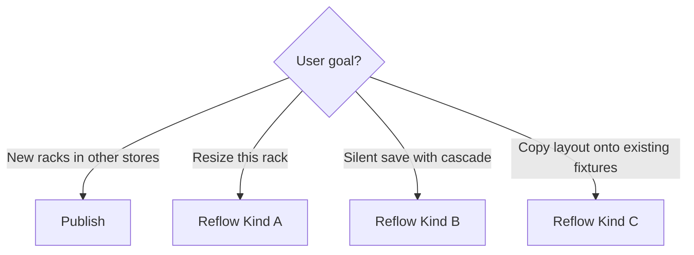

# Planogram & Reflow — Integration Handbook

**Purpose:** Portable reference for integrating or re-implementing Aisleris planogram layout, reflow, and publish flows in another app or service.  
**Units:** meters everywhere in API and editor.  
**Auth:** Bearer token; layout mutations need `layout:manage`, reads need `layout:view`.  
**Envelope:** `{ success | isRequestSuccess, data, message, errors }`.

This doc is self-contained. Related deep dives in this repo: `docs/FRONTEND_REFLOW.md`, `docs/FRONTEND_RACK_BLUEPRINT.md`, `docs/FRONTEND_PLANOGRAM_VISUALIZATION.md`.

---

## 1. Planogram mental model

Authoring happens in the **store layout editor** (3D / traditional). The portal “planogram screen” is a **read-only** view of one shelf face.

```
Store
 └── Rack (fixture)          ← outer / shell / inner / placement
      └── Side (S1, S2…)     ← 1:1 optional Shelf for planogram viz
           └── Row (shelf)   ← height, span, yStart/yEnd
                └── Bin      ← width, xStart/xEnd
                     └── SKU / products[]  ← facings via quantity
```

| Term | Meaning |
|------|---------|
| **Rack** | Physical fixture on the floor (`rackId`, `rackCode`, dimensions, placement) |
| **Side** | One face of a double-sided rack |
| **Shelf** (portal entity) | Linked 1:1 to a rack side for visualization / ideal image |
| **Row** | Horizontal shelf level inside a side |
| **Bin** | Slot on a row holding one or more SKUs |
| **Facing** | Displayed unit count for a SKU (`quantity`), capacity-driven |

### Important data sources

| Task | Endpoint |
|------|----------|
| List racks in a store | `GET /api/v1/layout/racks/by-store/{storeId}` |
| Full rack tree (editor) | `GET /api/v1/layout/racks/{rackId}/structure` |
| Blueprint document (3D) | `GET /api/v1/layout/racks/{rackId}/blueprint` |
| Save rack layout | `PUT /api/v1/layout/racks/{rackId}` |
| Attach SKU to bin | `POST /api/v1/layout/bin-inventory/attach` |
| Shelf planogram viz | `GET /api/v1/layout/shelves/{shelfId}/blueprint` |

---

## 2. Publish vs Reflow (do not confuse)

| | **Publish** | **Reflow** |
|---|-------------|------------|
| Intent | Clone a **new** rack into other stores | Adapt layout/facings on racks that **already exist** (or resize this rack) |
| Size | Targets get **same** outer dimensions as source | Kind C targets **keep** their own outer/shell |
| Floor placement | Not copied as publish clone identity | Kind C **keeps** target placement |
| Typical API | `POST .../publish` (+ `/preview`) | `POST .../reflow` or `.../reflow-to-racks` |



---

## 3. Reflow — what the engine does

On every reflow path the server typically:

1. Recomputes **inner** cavity from outer + shell  
2. Rescales **row heights** and **bin widths** by share  
3. Redraws anchors (`yStart`/`yEnd`, `xStart`/`xEnd`)  
4. Recomputes capacity and sets qty with **`FillToCapacity`** (qty → new max)  
5. Returns diffs: `quantityChanges`, `geometryChanges`, `exceptions`

**Critical rules**

- Unfit SKUs are **not** detached — they stay on the bin with qty/max `0` and appear in `exceptions`.  
- HTTP 200 + non-empty `exceptions` is still success (`needsAttention`).  
- Preview is dry-run; apply persists and refreshes ideal-order projections.

### Exception codes (common)

| Code | Meaning |
|------|---------|
| `SkuDoesNotFit` | Capacity 0 after change |
| `MissingDimensions` | SKU or bin dims missing |
| `RowSpanOverflow` | Row span > inner width |
| `BinWidthsOverflow` | Bin widths exceed row span |
| `RowHeightsOverflow` | Row heights exceed usable stack |

---

## 4. Three reflow kinds

### Kind A — Single-rack resize (`ApplyRackReflow`)

**When:** User changed this rack’s width/depth/height or shell and wants impact preview + apply.  
**Keeps:** Floor placement.  
**Changes:** Proposed outer/shell.

| Step | Method | Path |
|------|--------|------|
| Preview | `POST` | `/api/v1/layout/racks/{rackId}/reflow/preview` |
| Apply | `POST` | `/api/v1/layout/racks/{rackId}/reflow` |

**Request body** (`RackReflowRequest` — OpenAPI marks `outer` / `shell` required, nullable children OK):

```json
{
  "outer": { "width": 1.8, "depth": 0.5, "height": 2.0 },
  "shell": {
    "wallThickness": 0.08,
    "walls": { "back": true, "left": true, "right": true, "frontGlass": false }
  }
}
```

**Response `data`:**

```ts
{
  quantityChanges: Array<{
    binId: string
    skuId: string | null
    skuName: string | null
    fromQuantity: number | null
    toQuantity: number | null
    fromMaxQuantity: number | null
    toMaxQuantity: number | null
  }>
  geometryChanges: Array<{
    entityId: string  // row or bin
    field: string     // "height" | "width" | …
    from: number | null
    to: number | null
  }>
  exceptions: Array<{
    code: string
    message: string
    binId?: string | null
    rowId?: string | null
    skuId?: string | null
  }>
}
```

**UI flow:** Edit dims → Preview → Exception tray + change summary → Apply → Refetch structure/blueprint.

---

### Kind B — PUT hook (`reflowSkus`)

**When:** Same cascade as Kind A, but no dedicated preview payload.  
**Use only when** you do not need an exception tray before commit.

```
PUT /api/v1/layout/racks/{rackId}
```

```json
{
  "reflowSkus": true,
  "outer": { "width": 1.8, "depth": 0.5, "height": 2.0 },
  "shell": { "wallThickness": 0.08 },
  "sides": [ /* nested layout */ ]
}
```

Default `reflowSkus` is `false`. Response is a normal update success — **no** quantity/geometry/exceptions DTO.

---

### Kind C — Multi-rack map (`ApplyMultiRackReflow`)

**When:** Push a **source** rack’s SKU/bin topology onto **existing** target racks (same or other stores).  
**Keeps on target:** outer, shell, floor placement, rack identity.  
**Overwrites from source:** row/bin topology, SKU assignments, quantities (then reflowed), POSM refs (subject to store assignment).

| Step | Method | Path |
|------|--------|------|
| Preview | `POST` | `/api/v1/layout/racks/{sourceRackId}/reflow-to-racks/preview` |
| Apply | `POST` | `/api/v1/layout/racks/{sourceRackId}/reflow-to-racks` |

**Request body:**

```json
{
  "targetRackIds": [
    "019f6099-774a-7852-8463-897eaadf320e"
  ]
}
```

- `targetRackIds` must be real UUIDs (not empty strings).  
- Source must not appear in the target list.  
- Targets need at least as many active sides as the source.

**Response `data`:**

```ts
{
  targets: Array<{
    rackId: string
    storeId: string
    status: "ready" | "needsAttention" | "blocked" | "applied"
    outer: { width?: number; depth?: number; height?: number } | null
    quantityChanges: /* same as Kind A */
    geometryChanges: /* same as Kind A */
    exceptions: /* same as Kind A */
    warnings?: string[]
    errors?: string[]
  }>
}
```

| Status | Meaning |
|--------|---------|
| `ready` | Eligible, no exceptions (preview) |
| `needsAttention` | Exceptions present but still **commitable** |
| `blocked` | Skipped — see `errors` |
| `applied` | Persisted successfully (apply) |

Apply rules: `blocked` skipped; `ready` / `needsAttention` persisted. Ideal-order projections refresh per applied rack.

**UI flow:** Pick source → select target store → select existing racks → Preview (per-target cards) → Apply → open trays for `needsAttention`.

---

## 5. Publish (clone) — related but separate

```
POST /api/v1/layout/racks/{rackId}/publish/preview
POST /api/v1/layout/racks/{rackId}/publish
```

```json
{
  "storeIds": ["store-uuid-1", "store-uuid-2"],
  "rackCode": "R-01",
  "blueprintName": "Back-Wall Cooler"
}
```

Creates **new** racks in destination stores (same dimensions). Use Kind C instead when those racks already exist and only need layout mapped.

---

## 6. How this app wires it (for porting)

| User action (rack selected) | Kind | Next.js proxy | Backend |
|-----------------------------|------|---------------|---------|
| **Reflow preview** | A | `/api/racks/{id}/reflow/preview` → apply `/reflow` | `/api/v1/layout/racks/{id}/reflow…` |
| **Reflow to racks** | C | `/api/racks/{id}/reflow-to-racks/preview` → apply | `/api/v1/layout/racks/{id}/reflow-to-racks…` |
| Custom builder save | B | `PUT /api/racks/{id}` with `reflowSkus: true` | same |
| **Publish to stores** | — | `/api/racks/{id}/publish…` | `/api/v1/layout/racks/{id}/publish…` |

### Useful repo files

| Area | Path |
|------|------|
| Types | `src/types/rackReflow.ts`, `src/types/rackPublish.ts` |
| Client | `src/utils/rackReflowApi.ts`, `src/utils/rackPublishApi.ts` |
| Kind A UI | `src/components/RackReflowModal.tsx`, `ReflowExceptionTray.tsx` |
| Kind C UI | `src/components/MultiRackReflowModal.tsx` |
| Publish UI | `src/components/RackPublishModal.tsx` |
| Entry points | `src/components/ContextAddButton.tsx` (rack sidebar) |
| Proxies | `src/app/api/racks/[rackId]/reflow/**`, `reflow-to-racks/**`, `publish/**` |
| PUT + reflowSkus | `src/utils/rackBlueprintMapper.ts` → `buildUpdateRackPayload` |

### Example client (Kind A)

```ts
// Preview
await fetch(`/api/v1/layout/racks/${rackId}/reflow/preview`, {
  method: 'POST',
  headers: { Authorization: `Bearer ${token}`, 'Content-Type': 'application/json' },
  body: JSON.stringify({ outer: { width, depth, height }, shell: { wallThickness } }),
})

// Apply — same body
await fetch(`/api/v1/layout/racks/${rackId}/reflow`, { method: 'POST', /* … */ })
```

### Example client (Kind C)

```ts
await fetch(`/api/v1/layout/racks/${sourceRackId}/reflow-to-racks/preview`, {
  method: 'POST',
  headers: { Authorization: `Bearer ${token}`, 'Content-Type': 'application/json' },
  body: JSON.stringify({ targetRackIds: ['uuid-a', 'uuid-b'] }),
})

await fetch(`/api/v1/layout/racks/${sourceRackId}/reflow-to-racks`, {
  method: 'POST',
  /* same body */
})
```

---

## 7. Integration checklist (other FE / portal)

- [ ] Show exception tray whenever `exceptions.length > 0` (do not treat as hard failure)  
- [ ] Prefer Kind A (preview → apply) over Kind B when user must review impact  
- [ ] Kind C: store picker + existing rack list; exclude source id; filter invalid UUIDs  
- [ ] After apply, refetch `structure` / `blueprint` (and shelves if showing ideal order)  
- [ ] Warn on absurd qty jumps (`FillToCapacity` with bad dims can inflate facings)  
- [ ] Keep Publish and Reflow as separate product actions and copy  
- [ ] Dimensions: send **meters**; convert only for display  

---

## 8. Future (not in this reflow contract)

AI Planogram Scoring (`AI_Planogram_Scoring_Spec.md`) proposes a **Pass 2** score-based facing nudge on multi-store reflow and Generate / Suggestions consumers. Those APIs are **proposed / draft** and not required for the reflow kinds above.

---

## 9. Quick API index

| Kind | Preview | Apply |
|------|---------|-------|
| A resize | `POST /api/v1/layout/racks/{rackId}/reflow/preview` | `POST /api/v1/layout/racks/{rackId}/reflow` |
| B silent | — | `PUT /api/v1/layout/racks/{rackId}` + `reflowSkus: true` |
| C multi | `POST /api/v1/layout/racks/{sourceRackId}/reflow-to-racks/preview` | `POST /api/v1/layout/racks/{sourceRackId}/reflow-to-racks` |
| Publish | `POST /api/v1/layout/racks/{rackId}/publish/preview` | `POST /api/v1/layout/racks/{rackId}/publish` |

---

*Generated for planogram-verseye integration handoff. Safe to copy into another repo or Confluence as-is.*
