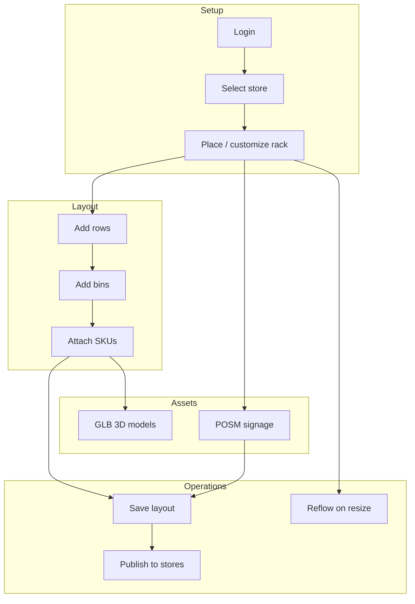
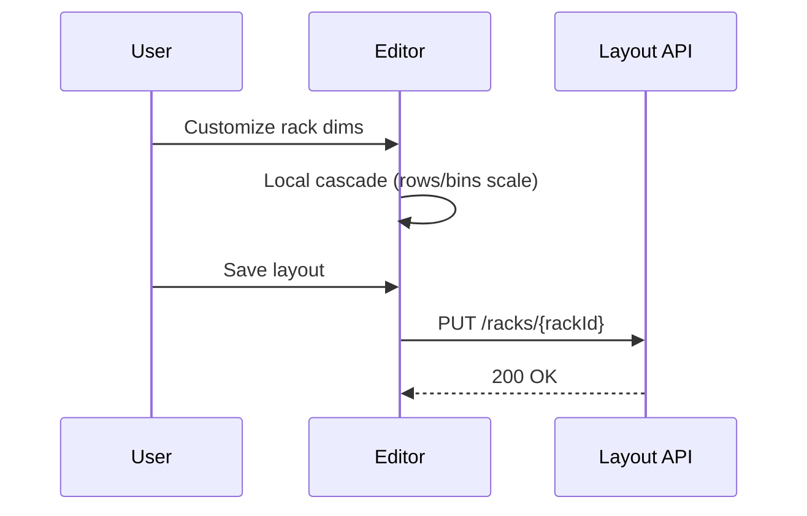
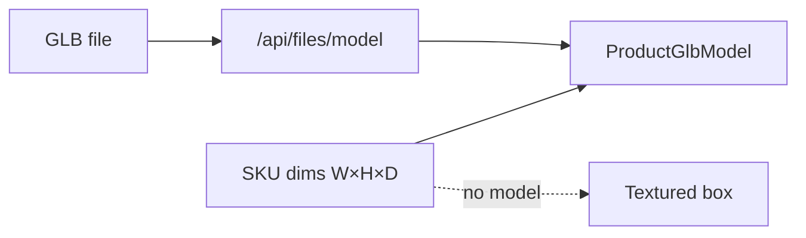
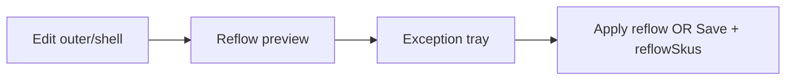

# Planogram Editor — Team Flow Guide

End-to-end guide for the **planogram-verseye** layout editor: how to build a store planogram from scratch, assign products (including 3D GLB models), place POSM signage, publish racks to other stores, and handle resize reflow.

**Units:** all dimensions are **meters** (see [LAYOUT_SCALE_SPEC.md](./LAYOUT_SCALE_SPEC.md)).

**Auth:** layout endpoints require `layout:manage`; POSM catalog requires `company-assets:view`.

---

## Table of contents

1. [Big picture](#1-big-picture)
2. [Worked example: “Summer Tea End Cap”](#2-worked-example-summer-tea-end-cap)
3. [Flow A — Store & rack setup](#3-flow-a--store--rack-setup)
4. [Flow B — Rows, bins & products](#4-flow-b--rows-bins--products)
5. [Flow C — 3D product models (GLB)](#5-flow-c--3d-product-models-glb)
6. [Flow D — POSM on rack surfaces](#6-flow-d--posm-on-rack-surfaces)
7. [Flow E — Publish rack to other stores](#7-flow-e--publish-rack-to-other-stores)
8. [Flow F — Resize reflow](#8-flow-f--resize-reflow)
9. [API quick reference](#9-api-quick-reference)
10. [Troubleshooting](#10-troubleshooting)

---

## 1. Big picture



| Layer | What the user sees | What persists on server |
|-------|-------------------|-------------------------|
| Warehouse | 3D floor, racks | Store layout |
| Rack | Shell, rows, bins | Blueprint + structure |
| Product | Box or GLB in bin | Bin inventory + SKU dims |
| POSM | Header / divider markers | `*PosmItemId` on shell/rows |
| Publish | Clone wizard | New racks per target store |
| Reflow | Exception tray | Updated geometry + SKU qty |

---

## 2. Worked example: “Summer Tea End Cap”

**Goal:** In **Store A (Karachi)**, build a promotional end-cap rack for Tapal green tea, assign a shelf-talker POSM, save, then clone the rack to **Store B (Lahore)**.

### Characters & IDs (example)

| Entity | Example value |
|--------|----------------|
| Store A | `store-a-guid` |
| Store B | `store-b-guid` |
| Rack code | `EC-TEA-01` |
| Rack outer | **0.90 × 0.50 × 1.80 m** (end cap) |
| Row height | **0.40 m** × 4 shelves |
| Bin | **0.28 × 0.45 × 0.35 m** |
| SKU | Tapal Green Tea Box |
| Product dims | **0.12 × 0.08 × 0.05 m** (12×8×5 cm) |
| GLB demo | `/models/tapal_green_tea_box.glb` |
| Facings | **4** per bin |

### Timeline (15-minute demo script)

| Step | Action | UI location |
|------|--------|-------------|
| 1 | Log in, open planogram editor | `/` |
| 2 | Select **Store A** | Store dropdown |
| 3 | Add rack → **Custom** or end-cap preset | + Add Rack |
| 4 | Set outer **0.90 × 0.50 × 1.80 m**, enable header | Custom Rack Builder |
| 5 | Place rack on floor, **Save layout** | Rack selected → Save layout |
| 6 | **+ Add Row** × 4 (height 0.40 m each) | Rack selected |
| 7 | **+ Add Bin** on row 3 (eye level) | Row selected |
| 8 | Attach SKU: create **Tapal Green Tea**, upload GLB or use demo | Bin → Attach product |
| 9 | Set quantity **4** facings, attach | Attach modal |
| 10 | Assign **ShelfTalker** POSM on row 3 divider | Row selected → Divider POSM |
| 11 | Assign **Standee** on header fascia | Rack selected → Rack POSM |
| 12 | **Save layout** | Rack selected |
| 13 | **Publish to stores** → select Store B → preview → publish | Rack selected |
| 14 | (Optional) Widen rack to **1.00 m** → **Reflow preview** → review exceptions → Apply | Custom Builder + Reflow |

### Expected 3D result

- Bins show **four** Tapal boxes (GLB scaled to 12×8×5 cm), not flat image squares.
- Row 3 front lip shows a **green** divider marker (`ShelfTalker` POSM).
- Header shows assigned POSM in the shell panel (3D shell markers can be added later; divider lip is rendered today).

### Expected API sequence (happy path)

```
GET  /api/locations/list
GET  /api/racks/by-store/{storeA}
POST /api/racks/add-by-location          → create rack
PUT  /api/racks/{rackId}                 → save shell + placement
POST /api/racks/add-row-by-side          → rows
POST /api/bins/...                       → bins
POST /api/products/create                → SKU + modelStorageKey
PUT  /api/products/{skuId}               → ensure width/height/depth > 0
POST /api/bins/attach-product            → binId, skuId, quantity: 4
PUT  /api/racks/{rackId}/posm-items      → header + row divider POSM
POST /api/racks/{rackId}/publish/preview → storeIds: [storeB]
POST /api/racks/{rackId}/publish         → clone to Store B
```

---

## 3. Flow A — Store & rack setup

### 3.1 Select store

1. Open the editor (dev default: `http://localhost:3001`).
2. Choose a store from the location list (`GET /api/locations/list` → branches).
3. Layout loads via `GET /api/racks/by-store/{storeId}`.

### 3.2 Place a rack

**Standard rack:** + Add Rack → set width/depth → click floor.

**Custom rack:** + Add Rack → **Customize** → set:

| Field | Example (end cap) | Notes |
|-------|-------------------|--------|
| Outer W × D × H | 0.90 × 0.50 × 1.80 | `outer` on API |
| Wall thickness | 0.08 | `shell.wallThickness` |
| Header | enabled, 0.15 m | Required for header POSM |
| Rows | added after place | via + Add Row |

Inner cavity is computed: `inner ≈ outer − 2×wallThickness`.

**Save:** Rack selected → **Save layout** → `PUT /api/racks/{rackId}`.



---

## 4. Flow B — Rows, bins & products

### 4.1 Rows

- Select rack → **+ Add Row** → height in meters (grocery default **0.40 m**).
- Row `span` must be ≤ rack **inner width**.

### 4.2 Bins

- Select row → **+ Add Bin** → name + W × D × H.
- Sum of bin widths on a row must be ≤ row span.

### 4.3 Attach product (catalog SKU)

Select bin → **Attach product**:

| Mode | When to use |
|------|-------------|
| **Browse** | Pick existing SKU from catalog |
| **Create** | New SKU + image + optional GLB |

**Important:** Backend requires **bin AND SKU** `width`, `height`, `depth` **> 0** before attach.

The editor automatically:

1. `PUT /api/bins/{binId}` — sync bin dims if needed  
2. `PUT /api/products/{skuId}` — sync SKU dims if missing  
3. `POST /api/bins/attach-product` — `{ binId, skuId, quantity }`

**Quantity (facings):** number of product facings in the bin (e.g. `4`). Fit check uses `Σ (product.width × quantity)` vs bin width.

### Example attach payload

```json
{
  "binId": "3fa85f64-5717-4562-b3fc-2c963f66afa6",
  "skuId": "3fa85f64-5717-4562-b3fc-2c963f66afa7",
  "quantity": 4
}
```

### Example SKU create (with GLB)

```json
{
  "name": "Tapal Green Tea Box",
  "code": "TAPAL-GT-12",
  "categoryId": "...",
  "width": 0.12,
  "height": 0.05,
  "depth": 0.08,
  "modelStorageKey": "skus/models/abc123.glb",
  "imageStorageKey": "skus/xyz.jpg",
  "status": "active"
}
```

---

## 5. Flow C — 3D product models (GLB)

Products render as **GLB models** when the SKU has a model; otherwise a **textured box** fallback is used.

### Data fields

| Field | Source | Load path |
|-------|--------|-----------|
| `modelUrl` | `/models/foo.glb` or HTTPS URL | Same-origin or `/api/files/model?url=` |
| `modelStorageKey` | Upload to object storage | `/api/files/model?key=` |

### Team demo (no upload)

1. Attach product → **Create** tab.  
2. Click **Use sample Tapal tea box (local demo)**.  
3. Dims auto-set to **0.12 × 0.08 × 0.05 m**.  
4. Attach → 3D shows `public/models/tapal_green_tea_box.glb` scaled to catalog size.

### Production upload

1. Attach product → Create → **Click to upload .glb**.  
2. File uploads via `POST /api/files/upload?folder=skus/models`.  
3. `modelStorageKey` saved on SKU create.  
4. Scene loads model through the proxy (avoids WebGL CORS issues).

### Scaling rule

The GLB is **uniformly scaled** to fit the catalog **width × height × depth**. Wrong catalog dims = stretched model → always set accurate W×H×D.



---

## 6. Flow D — POSM on rack surfaces

Rack signage uses **one Company Assets POSM item per surface** (not shelf talkers or secondary display programs).

### Surfaces

| UI panel | Surface | API write field |
|----------|---------|-----------------|
| Rack POSM | Header fascia | `headerPosmItemId` |
| Rack POSM | Footer kick plate | `footerPosmItemId` |
| Rack POSM | Left / right wall | `leftWallPosmItemId`, `rightWallPosmItemId` |
| Row divider POSM | Shelf lip | `dividerPosmItemId` |

### Picker data

`GET /api/company-assets/posm/list?storeId={storeId}&status=Active`

Filter: `Standee`, `ShelfTalker`, `Flyer`.

### Save

`PUT /api/racks/{rackId}/posm-items`

```json
{
  "headerPosmItemId": "posm-standee-guid",
  "footerPosmItemId": null,
  "rowPosmItems": [
    { "rowId": "row-guid", "dividerPosmItemId": "posm-talker-guid" }
  ]
}
```

### Disable rules (UI mirrors server)

| Picker | Disabled when |
|--------|----------------|
| Header POSM | `shell.header.enabled === false` |
| Footer POSM | `shell.footer.enabled === false` |
| Left wall | `shell.walls.left === false` |
| Right wall | `shell.walls.right === false` |

### 3D

Row divider POSM renders as a colored lip marker:

- **ShelfTalker** — green  
- **Standee** — purple  
- **Flyer** — blue  

---

## 7. Flow E — Publish rack to other stores

Clone a **fully built** source rack (shell, rows, bins, SKUs, quantities, POSM) into multiple stores **1:1**.

**Not copied:** floor position, rotation, quadrant, source IDs.

### UI steps

1. Select source rack (must have server UUID).  
2. **Publish to stores**.  
3. Enter **rack code** for targets (e.g. `EC-TEA-01`).  
4. Multi-select target stores.  
5. **Preview publish** — per store: `ready` or `blocked`.  
6. **Publish** — creates rack per ready store.

### API

**Preview**

```
POST /api/racks/{rackId}/publish/preview
```

```json
{
  "storeIds": ["store-b-guid", "store-c-guid"],
  "rackCode": "EC-TEA-01",
  "blueprintName": "Summer Tea End Cap"
}
```

**Publish** — same body:

```
POST /api/racks/{rackId}/publish
```

### Example preview response

```json
{
  "stores": [
    {
      "storeId": "store-b-guid",
      "status": "ready",
      "rackPreview": { "outer": { "width": 0.9, "depth": 0.5, "height": 1.8 } },
      "warnings": []
    },
    {
      "storeId": "store-c-guid",
      "status": "blocked",
      "errors": ["RackCodeConflict: EC-TEA-01 already exists in this store"]
    }
  ]
}
```

### Common blockers

| Error | Fix |
|-------|-----|
| Rack code conflict | Use a different `rackCode` in that store |
| POSM not assigned to store | Assign POSM to target store in Company Assets |
| SKU missing/inactive | Fix catalog SKU status |

---

## 8. Flow F — Resize reflow

When **outer** or **shell** dimensions change, the server can rescale row/bin geometry and adjust SKU quantities. SKUs that no longer fit **stay attached** and appear in `exceptions` — never hidden.

### When to use

- After editing rack outer size in **Custom Rack Builder**  
- Before committing a resize that might change facings  

### UI steps

1. Select rack (with pending dim changes saved locally).  
2. **Reflow preview**.  
3. Review:
   - **Quantity changes** — facings before → after  
   - **Geometry changes** — width/height field deltas  
   - **Exceptions** — `SkuDoesNotFit`, `RowSpanOverflow`, etc.  
4. Choose:
   - **Apply reflow** — `POST .../reflow` (server applies geometry + qty)  
   - **Save layout + reflow SKUs** — `PUT .../racks/{rackId}` with `reflowSkus: true`  
5. Layout reloads from server.

### API

**Preview**

```
POST /api/racks/{rackId}/reflow/preview
```

```json
{
  "outer": { "width": 1.0, "depth": 0.5, "height": 1.8 },
  "shell": { "wallThickness": 0.08 }
}
```

**Example response**

```json
{
  "quantityChanges": [
    {
      "binId": "bin-guid",
      "skuId": "sku-guid",
      "skuName": "Tapal Green Tea Box",
      "fromQuantity": 4,
      "toQuantity": 3,
      "fromMaxQuantity": 4,
      "toMaxQuantity": 3
    }
  ],
  "geometryChanges": [
    { "entityId": "row-guid", "field": "width", "from": 0.74, "to": 0.84 }
  ],
  "exceptions": [
    {
      "code": "SkuDoesNotFit",
      "message": "SKU remains on bin; quantity set to 0",
      "skuName": "Tapal Green Tea Box"
    }
  ]
}
```

**Apply**

```
POST /api/racks/{rackId}/reflow
```

Same body. Commit is allowed even when `exceptions` is non-empty — user must resolve unfit SKUs in the exception tray.



---

## 9. API quick reference

### Frontend proxies (Next.js app)

| Feature | Proxy route | Backend |
|---------|-------------|---------|
| Store list | `GET /api/locations/list` | `/api/v1/locations/branches` |
| Layout by store | `GET /api/racks/by-store/{storeId}` | layout racks |
| Save rack | `PUT /api/racks/{rackId}` | full blueprint |
| POSM assign | `PUT /api/racks/{rackId}/posm-items` | shell + row POSM |
| POSM catalog | `GET /api/company-assets/posm/list` | company assets |
| GLB proxy | `GET /api/files/model?key=` | presigned download |
| Image proxy | `GET /api/files/image?url=` | CORS-safe textures |
| Publish preview | `POST /api/racks/{rackId}/publish/preview` | multi-store clone |
| Publish | `POST /api/racks/{rackId}/publish` | multi-store clone |
| Reflow preview | `POST /api/racks/{rackId}/reflow/preview` | resize impact |
| Reflow apply | `POST /api/racks/{rackId}/reflow` | persist resize |

### Default dimensions (meters)

See [REALISTIC_DIMENSIONS.md](./REALISTIC_DIMENSIONS.md).

| Entity | Default |
|--------|---------|
| Warehouse floor | 30 × 20 × 8 |
| Rack (bay) | 2.7 × 1.1 × 6 |
| Grocery row spacing | 0.40 height |
| Product (generic) | 0.10 × 0.10 × 0.20 |
| Tea box (demo) | 0.12 × 0.08 × 0.05 |

---

## 10. Troubleshooting

| Symptom | Likely cause | Fix |
|---------|--------------|-----|
| Attach 422 “dimensions must be set” | Bin or SKU dims null/0 on server | Editor syncs dims before attach; verify SKU has W×H×D |
| Product shows flat box, not GLB | No `modelUrl` / `modelStorageKey` | Upload GLB or use demo button |
| GLB stretched | Wrong catalog dims | Set true product size in meters |
| POSM save 400 | POSM not in store / surface disabled | Assign POSM to store; enable header/footer/wall |
| Publish blocked | Code conflict or POSM/SKU issue | Read preview `errors[]` per store |
| Reflow exceptions | SKU too wide after shrink | Reduce facings or widen rack; SKU stays on bin |
| Save clears POSM | Full PUT without `*PosmItemId` | Include shell + row POSM IDs on rack save |

---

## Related docs

| Doc | Contents |
|-----|----------|
| [REALISTIC_DIMENSIONS.md](./REALISTIC_DIMENSIONS.md) | Warehouse / rack / product defaults |
| [RACK_DISPLAY_PROGRAMS.md](./RACK_DISPLAY_PROGRAMS.md) | POSM placement (current model) |
| [FRONTEND_RACK_BLUEPRINT.md](./FRONTEND_RACK_BLUEPRINT.md) | Blueprint / structure contract |
| [LAYOUT_SCALE_SPEC.md](./LAYOUT_SCALE_SPEC.md) | Coordinate system |
| [CUSTOM_RACK_BLUEPRINT.md](./CUSTOM_RACK_BLUEPRINT.md) | Custom shell builder |

---

## Demo checklist (printable)

- [ ] Login + select store  
- [ ] Place custom end-cap rack (0.90 × 0.50 × 1.80 m)  
- [ ] Add 4 rows + bin on eye-level row  
- [ ] Create SKU with Tapal GLB demo + 4 facings  
- [ ] Verify 3D GLB (not flat box)  
- [ ] Assign divider ShelfTalker + header Standee POSM  
- [ ] Save layout  
- [ ] Publish preview → publish to second store  
- [ ] (Optional) Widen rack → reflow preview → review exceptions → apply  
