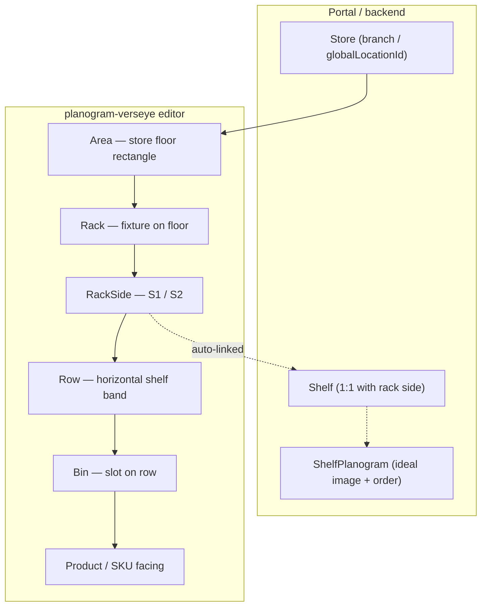
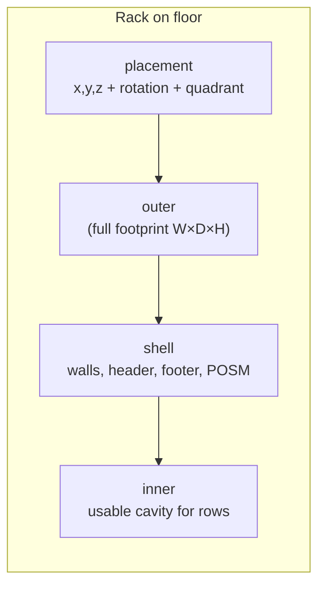
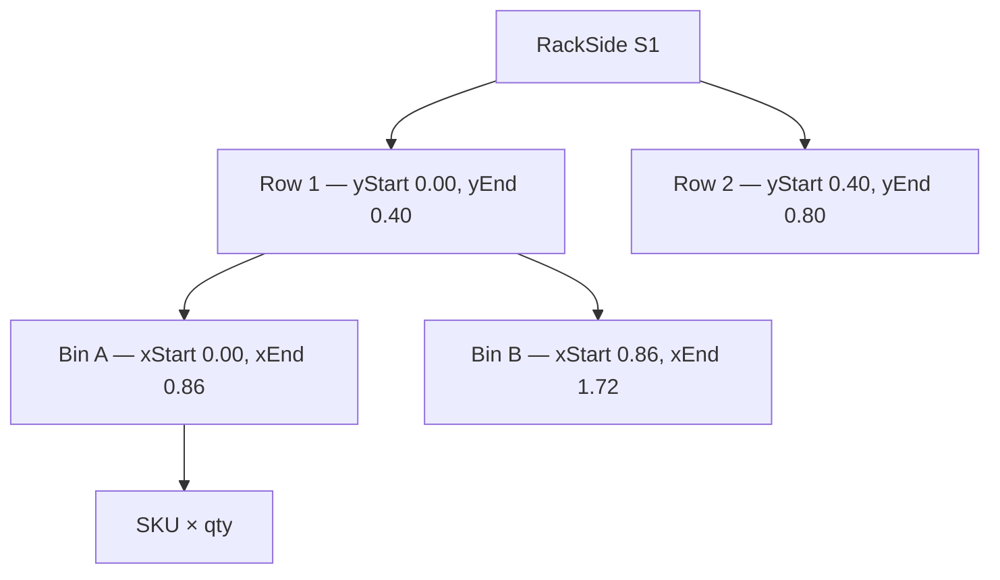
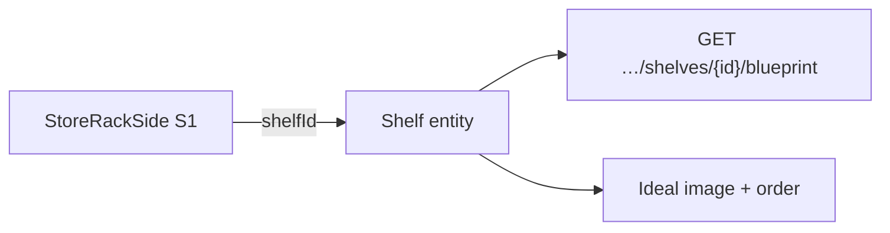
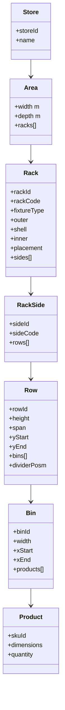

# Store Layout Structure — Full Hierarchy with Racks

**Purpose:** Visual reference for how a **store**, **floor**, and **racks** are modeled in planogram-verseye and the Aisleris layout API.

**Units:** all dimensions are **meters (m)**.

**Related docs:**
- [LAYOUT_SCALE_SPEC.md](./LAYOUT_SCALE_SPEC.md) — coordinates, quadrants, floor bounds
- [FRONTEND_RACK_BLUEPRINT.md](./FRONTEND_RACK_BLUEPRINT.md) — API contract, PUT/POST payloads
- [FRONTEND_CHANGES_VS_MAIN.md](./FRONTEND_CHANGES_VS_MAIN.md) — shelf entity, POSM, publish/reflow
- [RACK_DISPLAY_PROGRAMS.md](./RACK_DISPLAY_PROGRAMS.md) — POSM on rack surfaces

---

## 1. Top-level hierarchy



| Level | What it is | Typical IDs |
|-------|------------|-------------|
| **Store** | Selected retail location | `storeId` / `globalLocationId` |
| **Area** | Floor bounds in the 3D scene | `width`, `depth` (no server id) |
| **Rack** | One fixture (gondola, custom bay, cooler…) | `rackId`, `rackCode` |
| **Side** | Shopper-facing face of a rack | `sideId`, `sideCode` (`S1`, `S2`) |
| **Row** | One shelf height band on a side | `rowId` |
| **Bin** | Horizontal slot on a row | `binId` |
| **Product** | SKU facing(s) in a bin | catalog `skuId` |

---

## 2. Rack envelope (blueprint shell)

Every rack has three nested boxes plus placement on the floor:



| Field | Meaning | Example (CUSTOM-02) |
|-------|---------|---------------------|
| `outer.width` | Full rack width (X) | `2.7` |
| `outer.depth` | Full rack depth (Z) | `1.1` |
| `outer.height` | Total rack height (Y) | `2.0` |
| `shell.wallThickness` | Wall/post thickness | `0.06` |
| `shell.walls` | `back`, `left`, `right`, `frontGlass` | hollow bay: back+ sides, open front |
| `shell.header` | Top fascia band | `enabled`, `height: 0.35`, color |
| `shell.footer` | Base kick plate | `enabled`, `height: 0.12`, color |
| `inner` | Cavity for rows = outer − walls − header − footer | `2.58 × 0.98 × 1.51` |
| `placement.position` | Floor position (m) | `{ x, y: 0, z }` |
| `placement.rotation` | Euler radians | `{ x, y, z }` |
| `placement.snapMode` | e.g. `wall` | |
| `placement.quadrant` | `NW` / `NE` / `SW` / `SE` | from position |

**CUSTOM racks** also keep `customConfig` in the editor (mirrors `outer` + `shell`).

---

## 3. Side → rows → bins → products



### Row fields

| Field | Description |
|-------|-------------|
| `height` | Vertical band height (m) |
| `span` / `width` | Horizontal span inside **inner.width** |
| `yStart`, `yEnd` | Stacked vertical position on side |
| `dividerThickness` | Shelf lip thickness (default `0.025`) |
| `dividerPosmItemId` | Company Assets POSM on shelf lip |
| `dividerPosm` | Hydrated `{ id, name, posmType }` |
| `sided` | `one` or `two` |

### Bin fields

| Field | Description |
|-------|-------------|
| `binName` | Label |
| `width`, `depth`, `height` | Slot dimensions (m) |
| `slotIndex`, `slotCount` | Position among bins on row |
| `xStart`, `xEnd` | Horizontal extent on row |
| `products[]` | Blueprint facings (display) |
| Inventory SKU | Authoritative via `POST .../bin-inventory/attach` |

### Product / SKU facing

| Field | Description |
|-------|-------------|
| `id` | Catalog SKU uuid |
| `name`, `width`, `height`, `depth` | Required for attach (meters) |
| `quantity` | Facings count |
| `imageUrl`, `modelUrl` | 2D / GLB render |

---

## 4. POSM on rack surfaces

One POSM item per surface (Company Assets, not display programs):

| Surface | Write | Read |
|---------|-------|------|
| Header fascia | `shell.headerPosmItemId` | `shell.headerPosm` |
| Footer kick plate | `shell.footerPosmItemId` | `shell.footerPosm` |
| Left wall | `shell.leftWallPosmItemId` | `shell.leftWallPosm` |
| Right wall | `shell.rightWallPosmItemId` | `shell.rightWallPosm` |
| Row divider | `row.dividerPosmItemId` | `row.dividerPosm` |

**API:** `PUT /api/v1/layout/racks/{rackId}/posm-items`

---

## 5. Fixture types

| `fixtureType` | Label | Default W×D (m) | Sides |
|---------------|-------|-----------------|-------|
| `GONDOLA` | Gondola | 2.7 × 1.1 | 1 or 2 |
| `WALL_BAY` | Wall Bay | 2.7 × 0.55 | 1 |
| `END_CAP` | End Cap | 0.9 × 0.5 | 1 |
| `DUMP_BIN` | Dump Bin | varies | 1 |
| `PALLET_DISPLAY` | Pallet | varies | 1 |
| `REFRIGERATED` | Cooler | 1.8 × 0.72 | 1 |
| `FREEZER` | Freezer | varies | 1 |
| `PEGBOARD` | Pegboard | varies | 1 |
| `CHECKOUT` | Checkout | varies | 1 |
| `PROMOTIONAL` | Promo island | varies | 1 |
| `CUSTOM` | Custom rack builder | user-defined | 1 or 2 |

---

## 6. API map (load & save)

| Action | Method | Route |
|--------|--------|-------|
| List racks in store | GET | `/api/v1/layout/racks/by-store/{storeId}` |
| Full rack tree | GET | `/api/v1/layout/racks/{rackId}/structure` |
| 3D blueprint document | GET | `/api/v1/layout/racks/{rackId}/blueprint` |
| Create rack | POST | `/api/v1/layout/racks` |
| **Save full structure** | **PUT** | **`/api/v1/layout/racks/{rackId}`** |
| Add row | POST | `/api/v1/layout/rack-rows` |
| Add bin | POST | `/api/v1/layout/bins` |
| Attach SKU to bin | POST | `/api/v1/layout/bin-inventory/attach` |
| Assign POSM | PUT | `/api/v1/layout/racks/{rackId}/posm-items` |
| Publish rack to stores | POST | `/api/v1/layout/racks/{rackId}/publish` |
| Reflow on resize | POST | `/api/v1/layout/racks/{rackId}/reflow` |

**Editor proxies:** `/api/racks/...` → backend `/api/v1/layout/racks/...`

---

## 7. Example — one store, two racks

ASCII floor plan (top view, +X right, +Z down):

```
                    North (−Z)
                        ↑
    ┌─────────────────────────────────────────┐
    │              AREA 50m × 50m              │
    │                                          │
    │   CUSTOM-02          GONDOLA-01          │
    │   (2.7×1.1)          (2.7×1.1)           │
    │      ●                  ●                │
    │   SW quad            NE quad             │
    │                                          │
    └─────────────────────────────────────────┘
                        ↓
                    South (+Z)
```

### 7.1 Store + area (editor state)

```json
{
  "selectedStoreId": "b1000000-0000-4000-8000-000000000001",
  "selectedStoreName": "Karachi Flagship",
  "area": {
    "width": 50,
    "depth": 50,
    "racks": [ "… rack CUSTOM-02 …", "… rack GONDOLA-01 …" ]
  }
}
```

### 7.2 Rack — CUSTOM-02 (structure)

```json
{
  "rackId": "019f4c2d-92d4-72a1-a569-79d2fbf93062",
  "rackCode": "CUSTOM-02",
  "blueprintName": "CUSTOM-02",
  "fixtureType": "CUSTOM",
  "isDoubleSided": false,
  "outer": { "width": 2.7, "depth": 1.1, "height": 2.0 },
  "inner": { "width": 2.58, "depth": 0.98, "height": 1.51 },
  "placement": {
    "position": { "x": -6.78, "y": 0, "z": -2.97 },
    "rotation": { "x": 0, "y": 0, "z": 0 },
    "snapMode": "wall",
    "quadrant": "SW"
  },
  "shell": {
    "wallThickness": 0.06,
    "walls": { "back": true, "left": true, "right": true, "frontGlass": false },
    "header": {
      "enabled": true,
      "width": null,
      "depth": null,
      "height": 0.35,
      "color": "#2C5282",
      "emissive": "#1A365D"
    },
    "footer": {
      "enabled": true,
      "width": null,
      "depth": null,
      "height": 0.12,
      "color": "#ecf0f1"
    },
    "headerPosmItemId": null,
    "footerPosmItemId": null,
    "leftWallPosmItemId": null,
    "rightWallPosmItemId": null
  },
  "sides": [
    {
      "sideId": "019f4c2d-92d5-7b1e-94d9-c9d75ad2bcf4",
      "sideCode": "S1",
      "inner": { "width": 2.58, "depth": 0.98 },
      "rows": [
        {
          "rowId": "row-guid-1",
          "rowNumber": 1,
          "height": 0.4,
          "span": 2.58,
          "yStart": 0.0,
          "yEnd": 0.4,
          "dividerThickness": 0.025,
          "dividerPosmItemId": null,
          "bins": [
            {
              "binId": "bin-guid-1",
              "binName": "Left",
              "width": 1.29,
              "depth": 0.93,
              "height": 0.35,
              "slotIndex": 0,
              "slotCount": 2,
              "xStart": 0.0,
              "xEnd": 1.29,
              "products": [
                {
                  "id": "sku-guid-tea",
                  "name": "Tapal Green Tea",
                  "width": 0.12,
                  "depth": 0.08,
                  "height": 0.2,
                  "quantity": 3,
                  "imageUrl": "https://…"
                }
              ]
            },
            {
              "binId": "bin-guid-2",
              "binName": "Right",
              "width": 1.29,
              "depth": 0.93,
              "height": 0.35,
              "slotIndex": 1,
              "slotCount": 2,
              "xStart": 1.29,
              "xEnd": 2.58,
              "products": []
            }
          ]
        },
        {
          "rowId": "row-guid-2",
          "rowNumber": 2,
          "height": 0.4,
          "span": 2.58,
          "yStart": 0.4,
          "yEnd": 0.8,
          "bins": []
        }
      ]
    }
  ]
}
```

### 7.3 Rack — GONDOLA-01 (double-sided sketch)

```json
{
  "rackCode": "GONDOLA-01",
  "fixtureType": "GONDOLA",
  "isDoubleSided": true,
  "outer": { "width": 2.7, "depth": 1.1, "height": 2.0 },
  "placement": { "position": { "x": 4.2, "y": 0, "z": 3.1 }, "quadrant": "NE" },
  "sides": [
    { "sideCode": "S1", "rows": [ "…" ] },
    { "sideCode": "S2", "rows": [ "…" ] }
  ]
}
```

---

## 8. Shelf linkage (portal / planogram view)

Each **rack side** can link 1:1 to a **Shelf** entity (for planogram visualization & compliance):



| Field on shelf list | Meaning |
|---------------------|---------|
| `hasLayout` | Linked to a rack side with rows |
| `hasPlanogram` | Ideal image / order configured |
| `rackId`, `rackSideId` | Deep-link back to layout editor |

See [FRONTEND_PLANOGRAM_VISUALIZATION.md](./FRONTEND_PLANOGRAM_VISUALIZATION.md).

---

## 9. Editor file map

| Concept | Primary files |
|---------|----------------|
| Store state | `src/store/planogramStore.ts` — `Area`, `Rack`, `Row`, `Bin`, `Product` |
| API types | `src/types/rackBlueprint.ts` |
| Load store | `src/utils/storeLayoutLoader.ts` — `normalizeRack`, `fetchStoreRacks` |
| Save PUT body | `src/utils/rackBlueprintMapper.ts` — `buildUpdateRackPayload` |
| 3D render | `src/components/fixtures/FixtureRenderer.tsx`, `CustomRackMesh.tsx` |
| Custom shell UI | `src/components/CustomRackBuilder.tsx` |
| POSM | `src/components/RackPosmPanel.tsx`, `RowDividerPosmPanel.tsx` |

---

## 10. Quick validation rules

| Rule | Detail |
|------|--------|
| Row span | `row.span ≤ inner.width` |
| Row stack | `Σ row.height ≤ inner.height` |
| Bin width | Sum of bin widths ≤ row span |
| SKU attach | SKU `width/height/depth` required and > 0 |
| One inventory SKU per bin | Different SKU → detach first |
| POSM | Item must be assigned to store in Company Assets |
| Floor bounds | Rack footprint must fit inside `area.width × area.depth` |

---

## 11. Mermaid — full object tree (single rack)



---

*Generated for planogram-verseye — reflects `main-v2` layout model (meters, blueprint shell, POSM, shelf linkage).*
